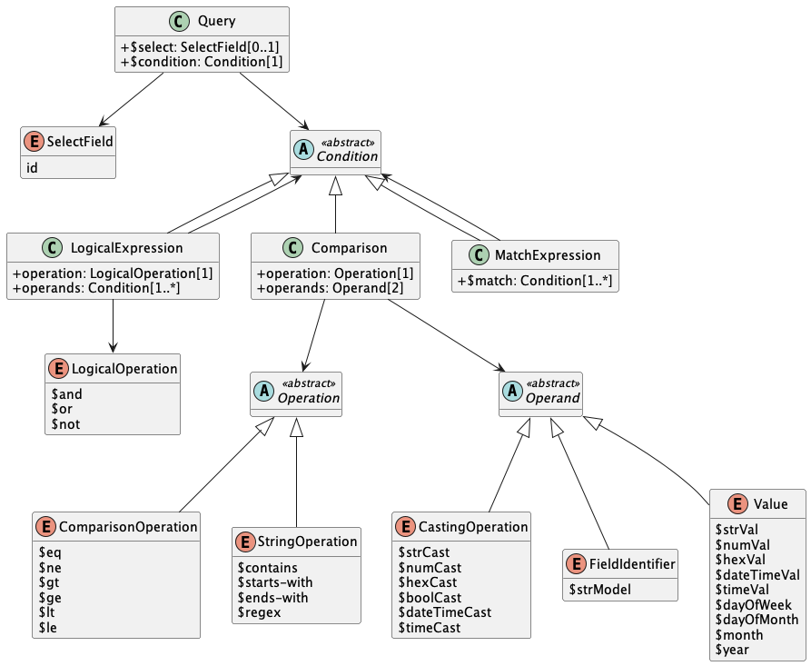

////
Copyright (c) 2023 Industrial Digital Twin Association

This work is licensed under a [Creative Commons Attribution 4.0 International License](
https://creativecommons.org/licenses/by/4.0/).

SPDX-License-Identifier: CC-BY-4.0

////

= General

== Services, Interfaces and Interface Operations

This document uses the Industrie 4.0 Service Model illustrated in

<<i40-service-model>> for a uniform understanding and naming. It basically distinguishes between associated concepts on several levels (from left to right):

* technology-neutral level: concepts that are independent from selected technologies;
* technology-specific level: concepts that are instantiated for a given technology and/or architectural style (e.g. HTTP/REST, OPC UA, MQTT);
* implementation level: concepts that are related to an implementation architecture that comprises one or more technologies (e. g. C#, C++, Java, Python);
* runtime level: concepts that are related to identifiable components in an operational Industry 4.0 system.

This document deals with the concepts of the technology-neutral and technology-specific level. However, to avoid terminological and conceptual misunderstandings, the whole Industrie 4.0 Service Model is provided here.

The technology-neutral level comprises the following concepts:

* *Service*: a service describes a demarcated scope of functionality (including its informational and non-functional aspects), which is offered by an entity or organization via https://www.plattform-i40.de/PI40/Redaktion/EN/Glossary/I/interface_glossary.html[interfaces].
* *Interface*: this is the most important concept as it is understood to be the unit of reusability across services and the unit of standardization when mapped to application programming interfaces (API) in the technology-specific level. One interface may be mapped to several APIs depending on the technology and architectural style used, e.g. HTTP/REST or OPC UA, whereby these API mappings also need to be standardized for the sake of interoperability.
* *Interface-Operation*: interface operations define interaction patterns via the specified interface.

The technology-specific level comprises the following concepts:

* *Service Specification*: specification of a service according to the notation, architectural style, and constraints of a selected technology. Among others, it comprises and refers to the list of APIs that forms this service specification. These may be I4.0-defined standard APIs but also other, proprietary APIs.


====
Note: such a technology-specific service specification may be but does not have to be derived from the “service” described in the technology-neutral form. It is up to the system architect and service engineer to tailor the technology-specific service according to the needs of the use cases.
====


* *API*: specification of the set of operations and events that forms an API in a selected technology. It is derived from the interface description on the technology-neutral level. Hence, if there are several selected technologies, one interface may be mapped to several APIs.
* *API-Operation*: specification of the operations (procedures) that may be called through an API. It is derived from the interface operation description on the technology-neutral level. When selecting technologies, one interface operation may be mapped to several API-operations; several interface operations may also be mapped to the same API-operation.

The implementation level comprises the following concepts:

* *Service-Implementation*: service realized in a selected implementation language following the specification in the Service Specification description on the technology-specific level.
* *API-Implementation*: set of operations realized in a selected implementation language following the specification in the API description on the technology-specific level.
* *API-Operation-Implementation*: concrete realization of an operation in a selected implementation language following the specification in the API-Operation description on the technology-specific level.

The runtime level comprises the following concepts:

* *Service-Instance*: instance of a Service-Implementation including its API-Instances for communication. Additionally, it has an identifier to be identifiable within a given context.

* *API-Instance*: instance of an API-Implementation which has an endpoint to get the information about this instance and the related operations.

* *API-Operation-Instance*: instance of an API-Operation-Implementation which has an endpoint to get invoked.

.Services, Interfaces & APIs and Operations
[[i40-service-model]]
image::i40-service-model.png[image3,width=608,height=361]

One important message from the Industrie 4.0 Service Model is that it is the level of the interface (mapped to technology-specific APIs) that

* provides the unit of reusability,
* is the foundation for interoperable services, and
* provides the reference unit for compliance statements.

Therefore, this document defines the interfaces and operations which are needed for interaction regarding the elements of the Asset Administration Shell metamodel starting with Clause 5.

== Design Principles

The operations of the interfaces follow a resource-oriented approach which is close to general REST principles but not as strict in every situation. The approach consists of the three main agreements:

* Stateless: the API is stateless. Each operation is independent. The server is always consistent after each operation.
* Resources (nouns): each resource is a clearly defined noun. This means that it has a specific name and its relation to other nouns is defined. The nouns and the relationships between them are taken from the list of referable objects of “Specification of the Asset Administration Shell Part 1” and their relationships. xref:specification/interfaces-payload.adoc#metamodel-specification-details[Metamodel Specification Details] gives an additional list of resources.
* Methods (verbs): a small set of standard REST methods (GET, POST, PUT, DELETE) is used to describe the semantic of the most common operations. There are only a few exceptions for situations where the standard methods do not fit (e.g. GETALL, SET, INVOKE).

The methods are:

* GET: a GET returns a single resource based on the resource identifier which is the identifier xref:bibliography.adoc#bib1[[1\]] for identifiables and the idShortPath for referables.
* GETALL: returns a list of resources based on optionally available parameters such as filters.
* QUERY: returns a list of resources based on filters expressed through the AAS Query Language.
* POST: creates a new resource. The identifier of the resource is part of the resource description. This is necessary because the id of identifiables is globally unique and should be the identifier for the object in every system. This implies that the creation of an identifiable is idempotent. There shall never be more than one identifiable with the same ID in one system. For example, trying to post the same AAS object twice will not create two AAS resources.
* PUT: replaces an existing resource.
* PATCH: updates an existing resource. The content to be replaced will be defined by the given SerializationModifiers, e.g. content=value provides the ValueOnly-serialization to update all values in the existing resource. The structure of the existing resource on the server and of the content given by the PATCH must be the same.


====
Note: values remain unchanged with content=metadata.
====


* DELETE: deletes a resource based on a given identifier.
* SET: sets the value of an object, e.g. the value of a Property.
* INVOKE: invokes an operation at a specified path.


====
Note: these methods are intended for the naming of interfaces as described in
<<i40-service-model>>. They shall not be interpreted as new protocol methods, e.g. on HTTP level.
====


Naming rules for operations:


The following rules shall apply for the operation names in Asset Administration Shell Interface, Submodel Interface, Shell Repository Interface, Submodel Repository Interface, Concept Description Repository Interface:

[listing]
....
<Interface Operation> ::= <Method Verb><Model Element Name>[<Modifier>]["By"<By-Qualifier>]

<Method Verb> ::= "Get" | "GetAll" | "Query" | "Put" | "PutBulk" | "Post" | "PostBulk" | "Patch" | "Delete" | "DeleteBulk" | "SetInvoke" | "InvokeAsync" | "SearchAll"

<Model Element Name> ::= "AssetAdministrationShell"["Ids"|"s"] | "AssetAdministrationShellDescriptor"["Ids"|"s"] | "SubmodelReference"["s"] | "AssetInformation" | "Submodel"["Ids"|"s"] | "SubmodelDescriptor"["Ids"|"s"] | "SubmodelElement"["s"] | "ConceptDescription"["Ids"|"s"]

<Modifier> ::= "Value" | "IdShortPath" | "Reference"

<By-Qualifier> ::= | "Id" | "SemanticId" | "ParentPathAndSemanticId" | "Path" | "AssetId" | "IdShort" | "IsCaseOf" | "DataSpecificationReference"
....


[.underline]#Examples:#

_GetSubmodel_ has method verb “Get” and model element name “Submodel”.

_GetAllSubmodelElementsByPath_ has method verb “GetAll” and model element name “SubmodelElements” plus a by-qualifier “Path”.


== Semantic References for Operations

The operations of this document need unique identifiers to reach a common understanding and allow all involved parties to reference the same things. These identifiers need to be globally unique and understandable by the community and implementing systems. Furthermore, the identifiers need to support a versioning scheme for future updates and extensions of the metamodel. The identifiers defined in this document are reused in related resources, for instance REST API operations or in self-descriptions of implementing services.

Internationalized Resource Identifiers (IRIs), Uniform Resource Identifiers (URIs) xref:bibliography.adoc#bib5[[5\]] in particular, and the requirements of DIN SPEC 91406 xref:bibliography.adoc#bib6[[6\]], serve as the basic format. Further design decisions include ‘https’ as the URI scheme, and the controlled domain name ‘admin-shell.io’ as the chosen authority. Both decisions guarantee the interoperability of the identifiers and their durability, since URIs are generally well-known and proven, while the domain is controlled and served through the Plattform Industrie 4.0. All identifiers included in the ‘admin-shell.io’ domain are described in a lightweight catalogue in the form of markdown documents; they are continuously maintained and updated [https://github.com/admin-shell-io/id]. The catalogue itself is structured in several sub-namespaces specified by the first path parameter. All URIs of this document reflect entities of the core metamodel, which are contained in the sub-namespace identified with the ‘/aas/API’ path.

The described identifiers appear mainly in the semanticId field of every class and operation. They are required since the class name is not necessarily constant over time. The respective semanticIds, however, guarantee the unique and certain relation between a reference and the referenced class or operation. The URIs are constructed as follows (compare to Clause Semantic Identifiers for Metamodel and Data Specifications in Part 1 xref:bibliography.adoc#bib1[[1\]]).


====
Note 1: version information is explicitly included in each identifier.

Note 2: even though the usage of the ‘https’ scheme might indicate URLs, all identifiers are regarded as URI look ups; dereferencing them cannot be expected.
====


The following grammar is used to create valid identifiers:

[listing]
....

<Identifier> ::= <Namespace>"/aas/API/"<OperationName>"/"<Version>

<Namespace> ::= "https://admin-shell.io

<OperationName> ::= {<Character>}+

<Version> ::= {<Digit>}+"/"{<Digit>}+["/"{<Character>}+]

<Digit> ::= "0" | "1" | "2" | "3" | "4" | "5" | "6" | "7" | "8" | "9"

<Character> ::= an unreserved character permitted by DIN SPEC 91406

? ::= zero or one

+ ::= one or more
....

Examples for valid identifiers:

[example]
* \https://admin-shell.io/aas/API/GetSubmodel/1/23
* \https://admin-shell.io/aas/API/GetAllSubmodelElements/1/0/RC03
* \https://admin-shell.io/aas/API/GetAllSubmodelElements/3/0

Examples for invalid identifiers:

[example]
* \http://admin-shell.io/API/GetSubmodel/1/0 +
The scheme is different to ‘https’, and the ‘aas’ path segment is missing
* \https://admin-shell.io/aas/API/GetSubmodel +
Version information is missing
* \https://admin-shell.io/aas/API/GetSubmodel/1/0#0173-%20ABC#001 +
The URI includes DIN SPEC 91406-reserved (#) and impermissible (%) characters


== References and Keys

The concept of references is introduced in Part 1 of the series “Specification of the Asset Administration Shell” xref:bibliography.adoc#bib1[[1\]].

When defining interfaces, a distinction is made between relative references and absolute references.

Absolute references require a global unique id as starting point of the reference to be resolvable. In this case the type “Reference” is used.

Relative references do not start with a global unique id. Instead, it is assumed that the context is given and unique. In this case, the key list only contains keys with _Key/type_ that references a non-identifiable referable (e.g. a Property, a Range, a RelationshipElement, etc.).


== Relation of Interfaces

The following chapters define several interfaces, which work together as a system and support different deployment scenarios.

There are three major components of the overall system:

[arabic]
. Repositories store the data of Asset Administration Shells, Submodels, and Concept Descriptions,
. Registries are “directories” which store AAS-IDs and Submodel-IDs together with the related endpoints (typically a URL-path into a repository or to a single AAS/Submodel),
. discovery (servers) supports a fast search and only store copies of essential information, i.e. key value pairs to find IDs by other IDs.

<<asset-related-info-retrieval>> shows a typical sequence. Discovery finds the AAS-ID for a given Asset-ID. A Registry provides the endpoint for a given AAS-ID. Such an endpoint for an AAS and the related Submodel-IDs make the submodels with their submodelElements accessible.

.Retrieval of Asset-related Information by AAS and Submodels
[[asset-related-info-retrieval]]
image::asset-related-info-retrieval.jpeg[width=642,height=610]

The Asset Administration Shell model is an asset-oriented model.

An Asset-ID may be retrieved e.g. by a QRCODE on the asset, by an RFID for the asset, from the firmware of the asset or from an asset database. IEC 61406 (formerly DIN SPEC 91406) defines the format of such Asset-IDs.

The “Administration Shell Basic Discovery Interface” may be used with an Asset-ID to get the related AAS-IDs (“GetAllAssetAdministrationShellIdsByAssetLink”).

The “Asset Administration Shell Registry Interface” may be used with an AAS-ID to retrieve the related descriptor for an AAS (“GetAssetAdministrationShellDescriptorById”). The retrieved AAS Descriptor includes the endpoint for the “Asset Administration Shell Interface”.

The “Asset Administration Shell Interface” makes the information about the AAS itself and the references to the related submodels available.

The related submodels of an AAS are retrieved by “GetAllSubmodelReferences”. Such a reference includes the SM-ID of a related submodel.

Similarly to the AAS above, the “Submodel Registry Interface” may be used to retrieve the related descriptor for a submodel (“GetSubmodelDescriptorById”) with a specific SM-ID. The retrieved Submodel Descriptor includes the endpoint for the “Submodel Interface”.

The “Submodel Interface” makes the information about the submodel itself and all its included submodel elements available.

Asset Administration Shells and submodels may be deployed on different endpoints in different ways.

One example is the deployment of an AAS on a device. In this case, the AAS might be fixed and might not be changed or deleted. In a cloud scenario, a single AAS may also be deployed as a single container (e.g. docker container).

Another example is the deployment of many Asset Administration Shells in an AAS Repository. In this case, the “Asset Administration Shell Repository Interface” may allow to create and manage multiple AAS in the repository.

The separate interfaces of the HTTP/REST API allow many ways to support different deployments.

For an AAS repository, the combination [.gray]#“Asset Administration Shell Repository Interface”#, [.red]#“Asset Administration Shell Interface”#, [.blue]#“Submodel Interface”#, “Serialization Interface”, and “Self-Description Interface” is proposed.

This will result in the following HTTP/REST paths as described in a combined OpenAPI file (https://app.swaggerhub.com/apis/Plattform_i40/AssetAdministrationShellRepositoryServiceSpecification/V3.1_SSP-001)[For easier reading only the standard paths are shown in the following: $metadata, $value, $reference and $path parameter paths are additionally contained in the OpenAPI file.]:

[.gray]#/shells# +
[.gray]#/shells/\{aas-identifier}# +
[.gray]#/shells/\{aas-identifier}#[.red]##/asset-information## +
[.gray]#/shells/\{aas-identifier}#[.red]##/asset-information/thumbnail## +
[.gray]#/shells/\{aas-identifier}#[.red]##/submodel-refs## +
[.gray]#/shells/\{aas-identifier}#[.red]##/submodel-refs/\{submodel-identifier}## +
[.gray]#/shells/\{aas-identifier}#[.red]##/submodels/\{submodel-identifier}## +
[.gray]#/shells/\{aas-identifier}#[.red]##/submodels/\{submodel-identifier}##[.blue]#/submodel-elements# +
[.gray]#/shells/\{aas-identifier}#[.red]##/submodels/\{submodel-identifier}##[.blue]#/submodel-elements/\{idShortPath}# +
[.gray]#/shells/\{aas-identifier}#[.red]##/submodels/\{submodel-identifier}##[.blue]#/submodel-elements/\{idShortPath}/attachment# +
[.gray]#/shells/\{aas-identifier}#[.red]##/submodels/\{submodel-identifier}##[.blue]#/submodel-elements/\{idShortPath}/invoke# +
[.gray]#/shells/\{aas-identifier}#[.red]##/submodels/\{submodel-identifier}##[.blue]#/submodel-elements/\{idShortPath}/invoke-async# +
[.gray]#/shells/\{aas-identifier}#[.red]##/submodels/\{submodel-identifier}##[.blue]#/submodel-elements/\{idShortPath}/operation-status/\{handleId}# +
[.gray]#/shells/\{aas-identifier}#[.red]##/submodels/\{submodel-identifier}##[.blue]#/submodel-elements/\{idShortPath}/operation-results/\{handleId}# +
/serialization +
/description

If the repository also supports AASX Packages, it shall be extended by additionally supporting a “AASX File Server” Profile [Related OpenAPI file: https://app.swaggerhub.com/apis/Plattform_i40/AasxFileServerServiceSpecification/V3.1_SSP-001].

The example of a device or container containing one AAS with its related submodels will result in the following HTTP/REST paths as described in the related OpenAPI file (https://app.swaggerhub.com/apis/Plattform_i40/AssetAdministrationShellServiceSpecification/V3.1_SSP-001)^2^:

[.red]#/aas# +
[.red]#/aas/asset-information# +
[.red]#/aas/asset-information/thumbnail# +
[.red]#/aas/submodel-refs# +
[.red]#/aas/submodel-refs/\{submodel-identifier}# +
[.red]#/aas/submodels/\{submodel-identifier}# +
[.red]#/aas/submodels/\{submodel-identifier}#[.blue]##/submodel-elements## +
[.red]#/aas/submodels/\{submodel-identifier}#[.blue]##/submodel-elements/\{idShortPath}## +
[.red]#/aas/submodels/\{submodel-identifier}#[.blue]##/submodel-elements/\{idShortPath}/attachment## +
[.red]#/aas/submodels/\{submodel-identifier}#[.blue]##/submodel-elements/\{idShortPath}/invoke## +
[.red]#/aas/submodels/\{submodel-identifier}#[.blue]##/submodel-elements/\{idShortPath}/invoke-async## +
[.red]#/aas/submodels/\{submodel-identifier}#[.blue]##/submodel-elements/\{idShortPath}/operation-status/\{handleId}## +
[.red]#/aas/submodels/\{submodel-identifier}#[.blue]##/submodel-elements/\{idShortPath}/operation-results/\{handleId}## +
/serialization +
/description


====
Note: identifiers are base64url-encoded in the API, i.e. \{aas-identifier} and [.green]#\{submodel-identifier}#. [.blue]#The \{idShortPath} is URL-encoded in the API#.
====


== Query Language

Many use cases of the Asset Administration Shell require the involvement of a high number of Asset Administration Shells at the same time. Executing the business logic on all potentially involved Asset Administration Shells solely by the client application requires a huge amount of transferred data objects and bandwidth. It is therefore necessary to send parts of the filter and selection logic to the AAS hosting systems. The AAS Query Language enables AAS clients to describe and handover their interests and AAS servers to only respond with the needed data objects.

The Asset Administration Shell propagates a Query Language inspired by the so-called Resource Query Language (RQL [_add reference_]). This language follows a simplified grammar and expressiveness compared with RQL and other languages with a similar scope, e.g. SPARQL [add reference], GQL [add reference], or JsonPath [add reference]. The same language shall be used independent of the communication protocol, therefore, it is not limited to the HTTP API of the AAS. However, different communication protocols may treat aspects differently, e.g., by requiring different query or result set serialisations, variations in the order of constructs, or endpoint patterns. Nevertheless, all share the same expressiveness, and under same conditions a query shall lead to the same results independently of the chosen communication protocol.

====
Note: The AAS Query Language and the AAS Access Control Language (see TODO: add reference to the Security part) share the same BNF grammar. Therefore, the result is a superset, with `query` as the entrypoint for the Query Language. 
====


.Main elements of the AAS Query Language



=== Limitations

The AAS Query Language is not intended as feature-comparable to existing query languages like SPARQL or GQL. In case the expressiveness of such technologies is needed, a software vendor might additionally extend his service accordingly. However, in order to keep the additional overhead for AAS Query Language implementers as small as possible, the following limitations apply:

1. Only Identifiables are queryable: It is possible to formulate filters for Asset Administration Shells, Submodels, and their according Descriptors, as well as ConceptDescription but no further elements. In addition, also their identifiers (values of the "id" attributes) can be queried. This means in particular that not every Referable can be queried.

1. Only Repository and Registry Services have specified query functionalities: Querys on Asset Administration Shell Services or Submodel Services are not defined.

1. Only selected attributes defined by the AAS data model (TODO: insert reference) can be used in query filters: Usage of custom or vendor-specific attributes outside of the AAS specifications is generally not recommended and may lead to a rejections of the query by the receiving systems.

1. It is not possible to traverse through Entity (e.g. Entity/statements), AnnotatedRelationshipElement (e.g. AnnotatedRelationshipElement/annotations), or Operation (e.g. Operation/outputVariables). Only the fields `semanticId` `idShort`, `value`, and `valueType` are available for SubmodelElements.


=== Grammar

The content and structure of the AAS Query Language is defined in the context-free Backus-Naur form (BNF). See Appendix (TODO: insert reference) for more details on BNF. The detailed serialisation and interaction patterns are defined by the different technology mappings, e.g., the AAS HTTP API represents AAS Queries as JSON objects (see Clause (TODO: insert reference)). Other mappings may define different serialisations, however, all have to follow the general structure of queries defined in the following grammar.


// Updated grammar 2024-10-11 (from aorzelski) + additional extensions 2024-11-02 (from sebbader-sap)
This is the combined grammar for the AAS Query Language and the AAS Access Rules defined by the AAS Security specification (TOOD: add reference).
// (check by https://bnfplayground.pauliankline.com/)
// (see a running parser at https://grammar.aas-voyager.com/ )


include::./grammar.adoc

// examples for grammar as of 2024-11-24:
// $sm.#semanticId.type$eq"abc"
// $sme.someIdShort.someOtherIdShort.#semanticId.type$eq"abc"
// $sme.someIdShort.someOtherIdShort[3].#semanticId.type$eq"abc"
// $sm.#idShort$eq"example"
// $contains($sm.#idShort,"test")
// $sm.#idShort$eq"example"$and$contains($sm.#idShort,"test")
// $not(hex("12")$gt16#0ACD)$or12$eqnum("12")
// $not(hex("12")$gt16#0ACD)$or(hex($sm.#idShort)$ne16#ABC$and$sme.#value$gt12)$or12$eqnum("12")
// time(GLOBAL(LOCALNOW))$ge09:00$andtime(GLOBAL(LOCALNOW))$le17:00
// $selectid$where$sm.#idShort$eq"someIdShort"

// examples for grammar as of 2024-11-02:
// sm.$semanticId.$type eq "abc"
// sme.someIdShort.someOtherIdShort.$semanticId.$type eq "abc"
// sme.someIdShort.someOtherIdShort[3].$semanticId.$type eq "abc"
// sm.$idShort eq "example"
// contains(sm.$displayName.$text, "test")
// contains(sm.$description.$text, "test")
// sm.$idShort eq "example" and contains(sm.$description.$text, "test")
// not(hex("12") gt 16#0ACD)  or 12 eq num("12")
// not(hex("12") gt 16#0ACD) or (hex(sm.$idShort) ne 16#ABC and sme.$value gt 12) or 12 eq num("12")
// time(GLOBAL(LOCALNOW)) ge 09:00 and time(GLOBAL(LOCALNOW)) le 17:00
// select id where sm.$idShort eq "someIdShort"


// Examples for updated grammar:
// sm.idShort eq "example"
// contains(sm.description, "test")
// sm.idShort eq "example" and contains(sm.description, "test")
// not(hex("12") gt 16#0ACD) or (hex(sm.idShort) ne 16#ABC and sme.value gt 12) or 12 eq num("12")
// time(GLOBAL(LOCALNOW)) ge 09:00 and time(GLOBAL(LOCALNOW)) le 17:00

// Examples for initial grammar (todo: delete before publication):
// select id where idShort = "someIdShort"


=== Select Expression

The default return type is a list containing the respective AAS objects. For an AAS Repository, it's a list of Asset Administration Shells, while a Submodel Registry returns a list of SubmodelDescriptors. The optional `$select` statement declares whether the response shall deviate from this default behavior, and only return a list of identifiers instead of a list of objects (`$select id`).


=== Identification of Fields

Elements relevant for comparisons are described using an adapted IdShortPath notation. The declaration starts with kind of element that shall serve as the root of the expression, followed with an optional '.' as the separator symbol and an IdShortPath, and a mandatory declaration of the AAS attribute that shall be examined, separated via '#'.

....
FieldIdentifier ::= <RootDeclaration> ( "." <IdShortPath> | "" ) "#" <AttributeDeclaration>
....

[.underline]#Constraint AASa-TODO:# Only the SubmodelElements root delaration can be followed with IdShortPaths.


.Root Elements for Field Identifiers 
[.table-with-appendix-table]
[width=100%, cols="10%,40%,50%"]
|===
h| Root Element h| Definition h| Example
| `$aas` | Starting point for fields available in Asset Administration Shells | `$aas#assetInformation.assetKind`
| `$sm` | Starting point for fields available in Submodels | `$sm#semanticId.keys[].value`
| `$sme` | Starting point for fields available in Submodel Elements. Can be followed with an IdShortPath, see Clause AASa-TODO. Can start at any possible Submodel Element, is *not* restricted to Submodel Elements directly in the `Submodel/submodelElements` list. | `$sme.smeCollectionIdShort.propertyIdShort#value`
| `$cd` | Starting point for fields available in Concept Descriptions | `$cd#id`
| `$aasdesc` | Starting point for fields available in Asset Administration Shell Descriptors | `$aasdesc#submodelDescriptors[].endpoints[].protocolinformation.href`
| `$smdesc` | Starting point for fields available in Submodel Descriptors | `$smdesc#endpoints[].protocolinformation.href`
|===

Attribute declarations point to literal values that provide the input for comparisons. It is not possible to point to objects or lists, only atomic values. Attribute declarations present a subset of the attributes defined by the AAS Metamodel and the extension classes of Clause TODO.

.Attribute Elements for Field Identifiers. `<index>` is an optional nonNegativeInteger value.
[.table-with-appendix-table]
[width=100%, cols="10%,40%,50%"]
|===
h| Root Element h| Definition h| Example
| `id` | Identifier, e.g., of an AAS, Submodel, or Condept Description | `$aas#id`
| `idShort` | Value of the idShort attribute | `$aas#id`
| `assetInformation.assetKind` | Value of the assetKind attribute of an AAS | `$aas#assetInformation.assetKind`
| `assetInformation.assetType` | Value of the assetKind attribute of an AAS | `$aas#assetInformation.assetType`
| `assetInformation.globalAssetId` | Value of the globalAssetId attribute of an AAS | `$aas#assetInformation.globalAssetId`
| `assetInformation.assetInformation.specificAssetIds[<index>].name` | Name of a SpecificAssetId of an AAS | `$aas#assetInformation.assetInformation.specificAssetIds[].name`
| `assetInformation.assetInformation.specificAssetIds[<index>].value` | Value of a SpecificAssetId of an AAS | `$aas#assetInformation.assetInformation.specificAssetIds[1].value`
| `assetInformation.assetInformation.specificAssetIds[<index>].externalSubjectId.type` | Type of a Reference used as an externalSubjectId in a SpecificAssetId of an AAS | `$aas#assetInformation.assetInformation.specificAssetIds[<index>].externalSubjectId.type`
| `assetInformation.assetInformation.specificAssetIds[<index>].externalSubjectId.keys[<index>].value` | Value of a key of a Reference used as an externalSubjectId in a SpecificAssetId of an AAS | `$aas#assetInformation.assetInformation.specificAssetIds[0].externalSubjectId.keys[].value`
| `assetInformation.assetInformation.specificAssetIds[<index>].externalSubjectId.keys[<index>].type` | Type of a key of a Reference used as an externalSubjectId in a SpecificAssetId of an AAS | `$aas#assetInformation.assetInformation.specificAssetIds[0].externalSubjectId.keys[].type`
| `submodels` | Shortcut for Submodels referenced by an AAS, see Clause TODO: Insert ref to "Special Functions" | `$aas#submodels`
| `submodels.type` | Type of a Reference that associates an AAS with a Submodel | `$aas#submodels.type`
| `submodels.keys[<index>].value` | Value of a key used in a Reference that associates an AAS with a Submodel | `$aas#submodels.keys[].value`
| `submodels.keys[<index>].type` | Value of a key used in a Reference that associates an AAS with a Submodel | `$aas#submodels.keys[0].type`
| `semanticId` | Shortcut for semanticIds, see Clause TODO: Insert ref to "Special Functions" | `$sm#semanticId`
| `semanticId.type` | ReferenceType of a semanticId Reference | `$sm#semanticId.type`
| `semanticId.keys[<index>].type` | KeyType of a semanticId Reference | `$sm#semanticId.keys[].type`
| `semanticId.keys[<index>].value` | Value of a key of a semanticId Reference | `$sme#semanticId.keys[].value`
| `value` | Value of a Submodel Element | `$sme#value`
| `valueType` | ValueType of a Submodel Element | `$sme.someIdShort#valueType`
| `language` | Language of a Multilanguage Property | `$sme#language`
| `assetKind` | Value of the assetKind attribute of an AAS Descriptor | `$aasdesc#assetKind`
| `assetType` | Value of the assetKind attribute of an AAS Descriptor | `$aasdesc#assetType`
| `globalAssetId` | Value of the globalAssetId attribute of an AAS Descriptor | `$aasdesc#globalAssetId`
| `specificAssetIds[<index>].name` | Name of a SpecificAssetId of an AAS Descriptor | `$aasdesc#specificAssetIds[].name`
| `specificAssetIds[<index>].value` | Value of a SpecificAssetId of an AAS Descriptor | `$aasdesc#specificAssetIds[1].value`
| `specificAssetIds[<index>].externalSubjectId.type` | Type of a Reference used as an externalSubjectId in a SpecificAssetId of an AAS Descriptor | `$aasdesc#specificAssetIds[<index>].externalSubjectId.type`
| `specificAssetIds[<index>].externalSubjectId.keys[<index>].value` | Value of a key of a Reference used as an externalSubjectId in a SpecificAssetId of an AAS Descriptor | `$aasdesc#specificAssetIds[0].externalSubjectId.keys[].value`
| `specificAssetIds[<index>].externalSubjectId.keys[<index>].type` | Type of a key of a Reference used as an externalSubjectId in a SpecificAssetId of an AAS Descriptor | `$aasdesc#specificAssetIds[0].externalSubjectId.keys[].type`
| `endpoints[<index>].interface` | Interface of an endpoint of an AAS or Submodel

===
*Note*: Can only be used with Asset Administration Shell Descriptors or Submodel Descriptors.
===

 | `$aasdesc#endpoints[0].interface`
| `endpoints[<index>].protocolinformation.href` | Href of an endpoint of an AAS or Submodel 

===
*Note*: Can only be used with Asset Administration Shell Descriptors or Submodel Descriptors.
===

| `$smdesc#endpoints[0].protocolinformation.href`
| `submodelDescriptors.semanticId` | Shortcut for semanticIds, see Clause TODO: Insert ref to "Special Functions" | `$aasdesc#submodelDescriptors.semanticId`
| `submodelDescriptors.semanticId.type` | ReferenceType of a semanticId Reference used in a referenced Submodel of an Asset Administration Shell Descriptor | `$aasdesc#submodelDescriptors.semanticId.type`
| `submodelDescriptors.semanticId.keys[<index>].type` | KeyType of a semanticId Reference used in a referenced Submodel of an Asset Administration Shell Descriptor | `$aasdesc#submodelDescriptors.semanticId.keys[].type`
| `submodelDescriptors.semanticId.keys[<index>].value` | Value of a key of a semanticId Reference used in a referenced Submodel of an Asset Administration Shell Descriptor | `$aasdesc#submodelDescriptors.semanticId.keys[].value`
| `submodelDescriptors.id` | Identifier of a referenced Submodel as available in an Asset Administration Shell Descriptor | `$aasdesc#submodelDescriptors.id`
| `submodelDescriptors.idShort` | idShort of a referenced Submodel as available in an Asset Administration Shell Descriptor | `$aasdesc#submodelDescriptors.idShort`
| `submodelDescriptors.endpoints[<index>].interface` | Endpoint interface of a referenced Submodel as available in an Asset Administration Shell Descriptor | `$aasdesc#submodelDescriptors.endpoints[0].interface`
| `submodelDescriptors.endpoints[<index>].protocolinformation.href` | Endpoint href of a referenced Submodel as available in an Asset Administration Shell Descriptor | `$aasdesc#submodelDescriptors.endpoints[].protocolinformation.href`
|===

=== Comparison Operators

The following comparison operators are part of the query language. The result of a comparison shall always be (a) of type xs:boolean or (b) a comparison error, e.g., due to non-matching data types.

Comparisons are overloaded in the BNF grammar, which means that the same comparison can deal with several input types. For instance, `$eq`  can be used both for values of type xs:string and xs:int.

// TODO decide on alternative:
// Comparisons are generally not overloaded (TODO: Reference to https://www.w3.org/TR/xpath-functions-30/#func-overloading). This means that one single comparison operator shall only be used for the defined input type and result in an error otherwise. For instance, `eq` / `=` requires two input parameters of type xs:string. If the input parameters are of type xs:int, `numeric_equals` shall be used. Note that the functions for numeric comparisons, like `numeric_equals`, can be used for all numeric types (xs:int, xs:float, xs:double). Therefore, `numeric_equals` can compare a value of type xs:int with a value of type xs:double, according to the defined comparison rules.


[.table-with-appendix-table]
[width=100%, cols="10%,40%,50%"]
|===
h| Operator h| Description h| Definition
| `$eq` | Compares two values if they are identical. | Operator 'A eq B' in https://www.w3.org/TR/xpath-30/#mapping 
| `$ne` | Compares two values if they are not identical. | Operator 'A eq B' in https://www.w3.org/TR/xpath-30/#mapping 
| `$gt` | Checks whether one parameter is greater than another. | Operator 'A gt B' in https://www.w3.org/TR/xpath-30/#mapping 
| `$lt` | Checks whether one parameter is lower than another. | Operator 'A lt B' in https://www.w3.org/TR/xpath-30/#mapping 
| `$ge` | Checks whether one parameter is greater or equal than another. | Operator 'A ge B' in https://www.w3.org/TR/xpath-30/#mapping 
| `$le` | Checks whether one parameter is lower or equal than another. | Operator 'A ne B' in https://www.w3.org/TR/xpath-30/#mapping 
| `$starts-with` | Compares two string expressions whether the second parameter appears character-equal at the beginning of the first. | Defined as fn:starts-with in https://www.w3.org/TR/xpath-functions-30/#func-starts-with
| `$contains` | Compares two string expressions whether the second parameter appears as a substring inside of the first. | Defined as fn:contains in https://www.w3.org/TR/xpath-functions-30/#func-contains
// TODO: decide if needed | `$ends-with` | Compares two string expressions whether the first parameter appears character-equal at the end of the second. | Defined as fn:ends-with in https://www.w3.org/TR/xpath-functions-30/#func-ends-with
// TODO: decide if needed | `$regex` | Evaluates a regex expression in the first parameter against the string content of the second. | Defined as fn:contains in https://www.w3.org/TR/xpath-functions-30/#func-contains
// TODO: decide if needed | `$exists` | Checks if the argument is a non-empty sequence. | Defined as fn:exists in https://www.w3.org/TR/xpath-functions-30/#func-exists
|===

==== Example

The following example is used to illustrate the comparisons. The following Asset Administration Shell is used for the evaluations of the different operators.

```
{
    "modelType": "AssetAdministrationShell",
    "id": "https://example.com/asset-administration-shell-1",
    "assetInformation": {
        "assetKind": "Instance",
        "globalAssetId": "urn:asset-administration-shell-1",
        "specificAssetIds": [
            {
                "name": "supplierId",
                "value": "aas-1"
            },
            {
                "name": "customerId",
                "value": "aas-2"
            }
        ],
    },
    "submodels": [
        {
            "type": "ModelReference",
            "keys": [
                {
                    "type": "Submodel",
                    "value": "https://example.com/submodel-1"
                }
            ]
        },
        {
            "type": "ModelReference",
            "keys": [
                {
                    "type": "Submodel",
                    "value": "https://example.com/submodel-2"
                }
            ]
        }
    ],
}
```

[.table-with-appendix-table]
[width=100%, cols="45%,10%,45%"]
|===
h| Comparison h| Result h| Comment
| `$aas#idShort` +
 `$eq` +
 `$aas#assetInformation.assetType` | true | Both items are empty, therefore, they are equal.
| `$aas#idShort` +
`$le` +
`$aas#assetInformation.assetType` | true | `$eq` implies `$le`
| `$aas#idShort` +
`$ne` +
`$aas#assetInformation.assetType` | false | Both items are empty, therefore, they are equal.
| `1` `$le` `2` | true | Numeric comparison
| `1` `$gt` `2` | false | Numeric comparison
| `13` `$eq` `'13'` | false | Type mismatch
| `"a"` `$lt` `"b"` | true | String comparison
| `"1"` `$gt` `"2"` | false | String comparison
| `"11"` `$gt` `"2"` | false | String comparison is executed character-wise: The first character of the left parameter ("1") comes before the first character of the right parameter ("2").
| `$aas#assetInformation.assetKind` +
`$eq`  +
`$aas#submodels` | error | `$aas#submodels` is an incomplete declaration and requires further expression on the following attributes, e.g., `keys[].value`.
| `$aas#assetInformation.assetKind`  +
`$ne`  +
`$aas#submodels` | error | `$aas#submodels` is an incomplete declaration and requires further expression on the following attributes, e.g., `keys[].value`.
| `$aas#assetInformation.assetKind`  +
`$eq`  +
`$aas#assetInformation.assetKind` | true | Comparison of identical values
| `$aas#assetInformation.assetKind`  +
`$ne`  +
`$aas#assetInformation.assetKind` | false | Comparison of identical values
| `$aas#submodels` `$eq` `$aas#submodels` | error | `$aas#submodels` is an incomplete declaration and requires further expression on the following attributes, e.g., `keys[].value`.
| `$aas#assetInformation.assetKind` `$eq` `17` | false | Type mismatch
| `$aas#assetInformation.assetKind` `$ne` `17` | true | Type mismatch
| `$aas#assetInformation.assetKind`  +
`$le`  +
`$aas#assetInformation.assetKind` | true | `$eq` implies `$le`
| `bool("true")` `$ge` `bool("true")` | true | `$eq` implies `$ge`
| `bool("true")` `$gt` `bool("true")` | false | Booleans do not offer `$lt`/`$gt` comparison
| `$aas#id`  +
`$contains`  +
`"https://example.com/asset-administration"` | true | "https://example.com/asset-administration" is a substring of the `id` value ("https://example.com/asset-administration-shell-1")
|===


=== Logical Expressions

Logical expressions allow the combination of two or more single comparisons through AND or OR relations, and to negate the result of an expression. Furthermore, logical expressions can also used to combine other logical expressions.

[.table-with-appendix-table]
[width=100%, cols="10%,40%,50%"]
|===
h| Logical Operator h| Description h| Definition
| `$and` | Connects two or more expressions through a logical AND. | Defined by https://www.w3.org/TR/xpath-30/#doc-xpath30-AndExpr 
| `$or` | Connects two or more expressions through a logical OR. | Defined by https://www.w3.org/TR/xpath-30/#doc-xpath30-OrExpr 
| `$not` | Negates an expression. | The "not" operator inverts the truth value of its operand. If the operand is true, the result is false, and if the operand is false, the result is true. Defined by https://www.w3.org/TR/xpath-functions-30/#func-not
|===


=== Casting Operators

[.table-with-appendix-table]
[width=100%, cols="10%,40%,50%"]
|===
h| Casting Operator h| Description h| Definition
| `$str(<value>)` | Casts the `value` to `xs:string`. | Defined by https://www.w3.org/TR/xpath-functions-30/#func-string
| `$num(<value>)` | Casts the `value` to `xs:integer`. | Defined by https://www.w3.org/TR/xpath-functions-30/#func-number 
// __TODO:__ This implies that only double comparisons are possible...
| `$dateTime(<value>)` | Casts the `value` to `xs:dateTime`. | Defined by https://www.w3.org/TR/xpath-functions-30/#func-dateTime
| `$bool(<value>)` | Casts the `value` to `xs:boolean`. | Defined by https://www.w3.org/TR/xpath-functions-30/#func-boolean
| `$hex(<value>)` | Casts the `value` to `xs:hexBinary`. | // TODO: define properly
| `$dateTime(<value>)` | Casts the `value` to `xs:dateTime`. | // TODO: define properly
| `$time(<value>)` | Casts the `value` to `xs:time`. | // TODO: define properly
|===


=== Referring to Elements in Lists and Arrays

The AAS Metamodel defines several objects with lists as child elements, e.g., `SubmodelElementList/value`, `AssetInformation/specificAssetIds`, or `Reference/keys`. The AAS Query Language contains two different patterns to refer to elements inside these lists:

==== Specific Index Notation

In case the position inside the list is known, the query can directly leverage the index number inside square brackets.

....
<fieldIdentifier>[<index>]
....

For the first element of a SubmodelElementList with the idShort "smlIdShort", this notation may lead to a following declaration:

....
$sme.<someIdShortPath>.smlIdShort[0]
....

For the first key of a semanticId reference, this notation may lead to a following declaration:

....
$sme.<someIdShortPath>#semanticId.keys[0]
....


==== Any Element Notation

In case the position in the list is not known, the index inside the square brackets can be skipped. This means that at least one element has to fulfill the comparison to make the expression evaluate to `true`. 

....
<fieldIdentifier>[]
....

To refer to any element inside a SubmodelElementList with the idShort "smlIdShort", this notation may lead to a following declaration:

....
$sme.<somePath>.smlIdShort[]
....

For any key of a semanticId reference, this notation may lead to a following declaration:

....
$sme.<somePath>#semanticId.keys[]
....


=== Multiple Comparisons on single Elements of Lists 
// TODO: find better name for this effect. Proposals: 1. Hierarchical Comparisons, 2. Structured Comparisons, 3. Sequential Comparisons)

The `$match` operator signals that the following filter clauses (a) contain a list of elements, and that (b) all filters shall be evaluated on the same element of this list. 

====
Note 1: If the filter inside an `$match` clause contains expressions that are not pointing to the list under consideration, an error shall be returned.
====

The table illustrates the behavior using the example Asset Administration Shell above.

[.table-with-appendix-table]
[width=100%, cols="55%,10%,25%"]
|===
h| Comparison h| Result h| Comment
| 

$match( +
    $aas#assetInformation.specificAssetIds.name $eq "supplierId", +
    $aas#assetInformation.specificAssetIds.value $eq "aas-1" +
)
| 
[ +
    { +
        "modelType": "AssetAdministrationShell", +
        ... +
    } +
] +
| The values for 'supplierId' and 'aas-1' exist in the same SpecificAssetId object.
|
$match( +
    $aas#assetInformation.specificAssetIds.name $eq "supplierId", +
    $aas#assetInformation.specificAssetIds.value $eq "aas-2" +
)
| 
[ ] 
| The values for 'supplierId' and 'aas-2' do not exist in the same SpecificAssetId object.
| 
$and ( +
    $aas#assetInformation.specificAssetIds.name $eq "supplierId", +
    $aas#assetInformation.specificAssetIds.value $eq "aas-2" +
)

| 
[ +
    { +
        "modelType": "AssetAdministrationShell", +
        ... +
    } +
] +
| The values for 'supplierId' and 'aas-2' exist in the example AAS, even though in _different_ SpecificAssetId objects.
|
$match( +
    $or ( +
        $and ( +
            $aas#assetInformation.specificAssetIds.name $eq "supplierId", +
            $aas#assetInformation.specificAssetIds.value $eq "aas-1" +
        ),
        $and ( +
            $aas#assetInformation.specificAssetIds.name $eq "customerId", +
            $aas#assetInformation.specificAssetIds.value $eq "aas-2" +
        ) +
    ) +
)

| 
[ +
    { +
        "modelType": "AssetAdministrationShell", +
        ... +
    } +
] +
| Both AND conditions are fulfilled, even though for different SpecificAssetIds. Nevertheless, as therefore in both cases always one AND clause is fulfilled, the OR clause also evaluates to `true` for both items.
|===

=== Special Functions

Two special functions are defined with the AAS Query Language for filtering on `semanticId` and `specificAssetId` values due to their elevated position in many use cases.

`semanticId` is defined as the "value" of the first key of the semanticId Reference object. The following two expressions are equivilant: 
....
 <somePath>.semanticId 
 <somePath>.semanticId.keys[0].value
....

A comparison using the `semanticId` as a shortcut could look like the following:
....
$sme#semanticId $eq "https://example.com/a/semantic/id"
....


`specificAssetId` provides the option to directly evaluate zero or one condition of a potential `SpecificAssetId/name` and/or a `SpecificAssetId/value` attribute. The following usages are possible:

....
specificAssetId( <nameCondition> )
specificAssetId( <valueCondition> )
specificAssetId( <nameCondition>, <valueCondition> )
....

[.table-with-appendix-table]
[width=100%, cols="25%,75%"]
|===
h| Parameter h| Description
| <nameCondition> | A single string comparison using one of the operators "$starts-with", "$contains", or "$eq", comparing the content of the SpecificAssetId/name attribute to a given string literal.
| <valueCondition> | A single string comparison using one of the operators "$starts-with", "$contains", or "$eq", comparing the content of the SpecificAssetId/value attribute to a given string literal.
|===

====
Note: In case both <nameCondition> and <valueCondition> are set, they have to be evaluated on the same SpecificAssetId object.
====

The following three expressions are equivalent:
[.table-with-appendix-table]
[width=100%, cols="5%,40%,50%"]
|===
h| h| `specificAssetId` Notation h| Long Notation
|
|
$aas.specificAssetId( +
    name $eq "supplierId" +
)

|
$aas#assetInformation.specificAssetIds.name $eq "supplierId"
|
|
$aas.specificAssetId( +
    value $starts-with "aas" +
)

|
$aas#assetInformation.specificAssetIds.value $starts-with "aas"
|
|
$aas.specificAssetId( +
    name $eq "supplierId", +
    value $starts-with "aas" +
)

|
$match ( +
    $and ( +
        $aas#assetInformation.specificAssetIds.name $eq "supplierId", +
        $aas#assetInformation.specificAssetIds.value $starts-with "aas" +
    ) +
)
|
|===

=== Sorting and Pagination

The AAS Query Language does not introduce additional functionalities to control the pagination or sorting of the result sets. The general capabilities available for Operations apply as well for queries.